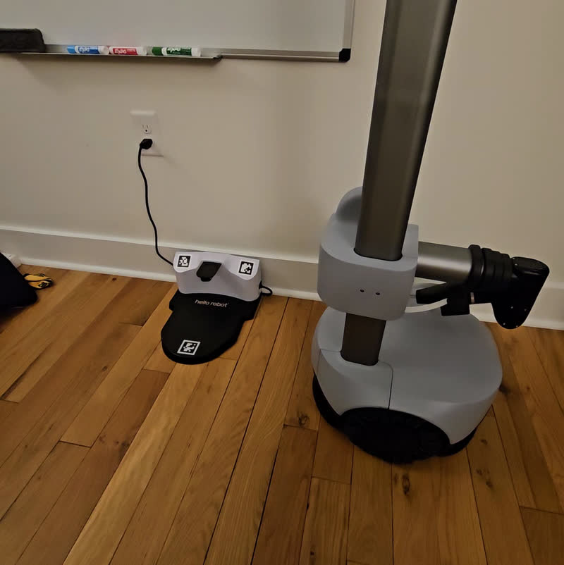
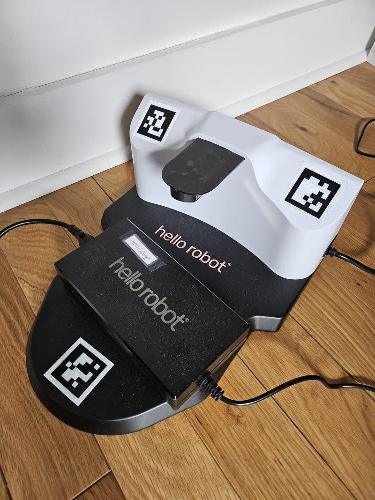

# Overview

https://github.com/user-attachments/assets/5769819d-2a6d-4df5-94b2-a1d8380427e4

An self-charging routine for Stretch 4 that docks the robot in under 20 seconds, while avoiding obstacles, during daytime or night, and functions on a variety of floorings and room layouts. I describe how it works in this [blog post](https://binitshah.github.io/blog/stretch-4-autodocking/). We welcome feedback in Github Issues or on [the forum](https://forum.hello-robot.com/).

## Quickstart

 1. `pip3 install hello-robot-stretch4-docking`

 1. Setup the Jetson *Coming soon*

 1. Put a docking station near the robot

    

 1. Use the CLI

    ```
    stretch_autodock
    ```

 1. Use the ROS2 docking servers

    [Create a map](https://docs.hello-robot.com/stretch4_docs/working-with-stretch/navigation/navigating_with_stretch) and ensure Nav2 is working. Then:
    ```
    Coming Soon
    # ros2 launch stretch_nav2 autodocking_cpu.launch.py
    # # In a separate terminal:
    # cd stretch_nav2
    # rviz2 -d rviz/autodocking_panel.rviz
    ```

## Assumptions

 1. Robot and dock is on flat level ground
 2. Dock is flat against a single wall, with free space to the left and right of the dock
 3. Robot should not see 2 docks at the same time (they can be in different rooms)
 4. Robot's arm must be stowed (retracted and lowered)

### Edge cases (!)

These edge cases are not supported currently. The robot may exhibit bad behavior under these conditions!

 1. Object on dock
    
 2. Object below dock
 3. Multiple docks in scene

## Developing

### Single vs. Dual Return

Each LiDAR's "return mode" can configured using the [pyhesai wrapper](https://github.com/hello-robot/stretch4_pyhesai_wrapper). Typically, a LiDAR either returns its strongest reading (single return) or last & strongest (dual return). This means the LiDARs report double the data in dual return mode, typ. ~230400 points.

Profiling `stretch_autodock` CLI, we found total latency (cloud in -> control out) dropped from an average of 49.95 ms (Dual) to 34.76 ms (Single), resulting in a ~30% computation overhead reduction.
 - Average dock ID-ing processing step decreased from 10.52 ms to 6.57 ms (~38% decrease).
 - Average ring filtering processing step decreased from 21.90 ms to 16.28 ms (~26% decrease).
 - Average costmap building processing step decreased from 15.10 ms to 10.07 ms (~33% decrease).

Rate Stability increased. Both configurations successfully maintain 10.0 Hz control, but the single return mode exhibits much higher frame rate stability (standard deviation of 0.02 Hz versus 0.15 Hz).

Rate stability and total latency directly affect the quality of motion during docking. If it's too high (>100ms), you'll see weird behavior from the routine. So if your LiDARS are configured for dual-return mode, `stretch_autodock` temporarily switches them to single-return for the duration of the routine. The ROS2 docking servers do **not** do this since developers may have concurrently running nodes that need the second set of returns. You can see which return mode your LiDARs are in using `REx_hesai_show_config`. To change it programmatically:

```python
from stretch4_pyhesai_wrapper.ptc_client import (
    LEFT_LIDAR_IP,
    RIGHT_LIDAR_IP,
    get_return_mode,
    set_return_mode,
    RETURN_MODE_NAMES,
)

# Set LiDARs to single-return if needed
lmode = get_return_mode(LEFT_LIDAR_IP)
rmode = get_return_mode(RIGHT_LIDAR_IP)
modes_before = None
if RETURN_MODE_NAMES.get(lmode, 'unknown') != 'strongest' or \
    RETURN_MODE_NAMES.get(rmode, 'unknown') != 'strongest':
    modes_before = (lmode, rmode)
    set_return_mode(LEFT_LIDAR_IP, 1) # 1 -> strongest
    set_return_mode(RIGHT_LIDAR_IP, 1)

# Change it back if needed
if modes_before is not None:
    lmode, rmode = modes_before
    set_return_mode(LEFT_LIDAR_IP, lmode)
    set_return_mode(RIGHT_LIDAR_IP, rmode)
```

### ROS2

*Coming Soon*

### Building your own docking pipeline (Advanced)

You can identify a dock and track it using:
```python
from stretch4_docking.trackers import DockTracker, DockAmbiguityError

tracker = DockTracker()
tracker.warm_start()  # compiles on first run, loads from cache afterwards

try:
    tracker.identify(points) # Nx4 (x,y,z,intensity)
except DockAmbiguityError as e:
    print('Only 1 dock allowed per room')

if tracker.is_tracking():
    print(tracker.get_pose()) # SE(3) pose as (x, y, z, qx, qy, qz, qw)
```

You can build a egocentric costmap using:
```python
from stretch4_docking.costmap import Costmap, RingFilter, LIDAR_LEFT_ORIGIN, LIDAR_RIGHT_ORIGIN

ring_filter = RingFilter()
ring_filter.warm_start()

costmapper = Costmap()
costmapper.warm_start()

left = ring_filter.process(left_frame.points, sensor_origin=LIDAR_LEFT_ORIGIN)
right = ring_filter.process(right_frame.points, sensor_origin=LIDAR_RIGHT_ORIGIN)
filtered_xyz = np.vstack([left[:, :3], right[:, :3]])
costmap = costmapper.process(filtered_xyz, dock_pose=tracker.get_pose())
```

You can servo (with collision awareness) using:
```python
from stretch4_docking.costmap import filter_clearance_velocity
from stretch4_docking.servo import XYThetaServo

servo_law = XYThetaServo()

errx, erry, errt = error
vx, vy, wz = servo_law.step(errx, erry, errt)
filtered = filter_clearance_velocity(vx, vy, wz, costmap.obstacle_xy, costmap.cliff_xy)
robot.set_velocity(filtered.vx, filtered.vy, filtered.wz)
robot.push_command()
```
